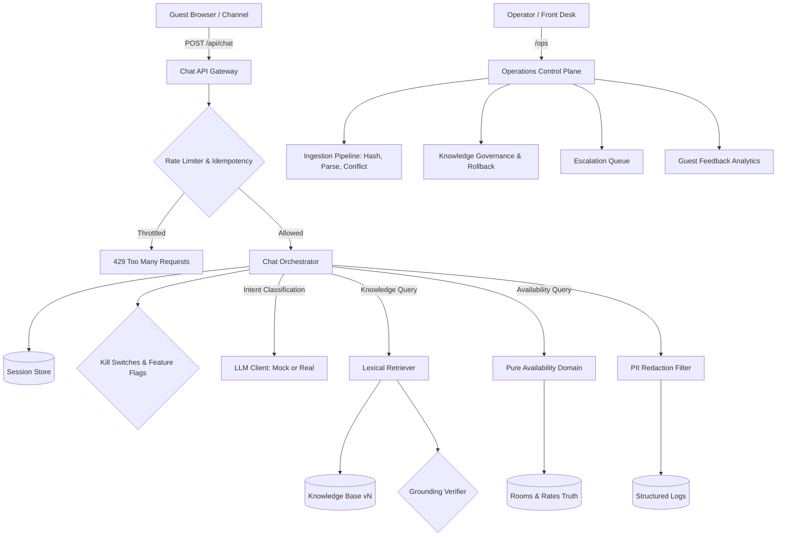
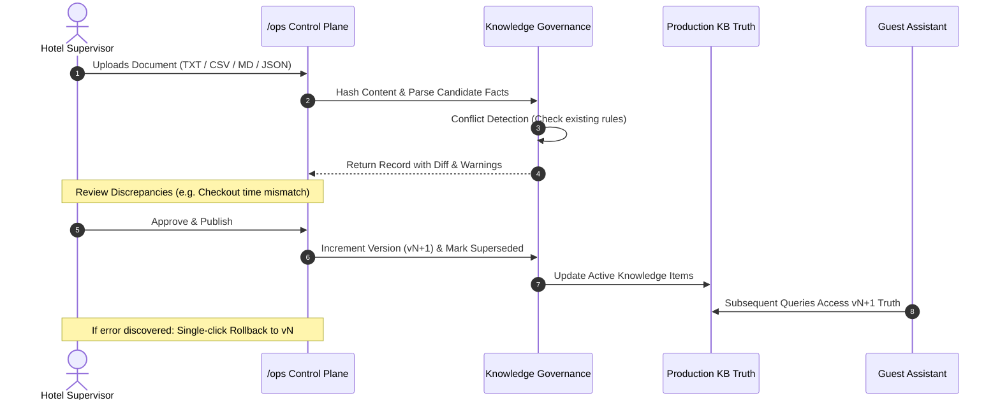

# Aster House Guest Assistant - Production System Design

## 1. System Overview & Invariants

The Aster House Guest Assistant is a guest-service orchestration platform exposing verified hotel knowledge, deterministic room discovery and availability, human escalation, operational content management, feedback capture, and AI-assisted natural-language interaction through a bounded conversational interface.

### The Two Architectural Laws
1. **Law 1 (AI Authority)**: The LLM handles language understanding, intent classification, and grounded phrasing. Deterministic software owns truth, rates, dates, capacity, policies, and availability authority.
2. **Law 2 (Productive Overengineering)**: Every added component must eliminate, detect, contain, recover from, or make observable a concrete production failure mode.

---

## 2. Request & Routing Lifecycle

1. **Gateway Ingress**:
   - Client sends `POST /api/chat` with `{ message, sessionId?, availability? }`.
   - Rate limiter checks sliding window token bucket (60 req/min per IP).
   - If `idempotency-key` is present and matches a recent submission (<2 min), cached response is returned immediately.
2. **Session Hydration**:
   - Session state is loaded via `SessionStore` interface (`InMemorySessionStore` locally, `RedisSessionStore` ready).
   - Existing availability slots are retrieved.
3. **Deterministic Pre-Routing**:
   - If structured availability form values are passed directly from UI controls, query bypasses LLM intent classification directly into `checkAvailability`.
4. **LLM Language & Intent Processing**:
   - If natural language message requires classification, `LLMClient.classifyIntent` categorizes query (`knowledge`, `room_suitability`, `availability`, `ambiguous`, `out_of_scope`).
   - If model times out (>4s) or errors, system gracefully falls back to deterministic FAQ/availability prompt.
5. **Domain Authority Execution**:
   - **Knowledge**: Lexical retriever scores facts against query. Grounded verifier verifies model claims against raw facts. If unsupported, honest abstention is returned.
   - **Suitability**: Capacity filtering filters room types (`maxOccupancy >= guests`).
   - **Availability**: Pure availability calculation checks date validity, calculates nights, and evaluates inventory.
6. **Session & Observability**:
   - Bounded turns appended to session.
   - Log event formatted with PII redaction (emails, phones, credentials scrubbed) and hashed session ID.

---

## 3. Knowledge Governance & Ingestion Pipeline

To prevent outdated policies or prompt injection attacks in documents from corrupting hotel truth:

---

## 4. Security & Privacy Boundaries

- **Zero Floating-Point Money**: All financial calculations use integer minor units (`Money.amountMinor`).
- **Hotel Timezone Awareness**: Business date logic respects `property.timeZone` (`America/New_York`) using date-only strings (`YYYY-MM-DD`).
- **Server-Derived Property Context**: `propertyId` is derived exclusively by server configuration. LLM cannot set or override property scope.
- **PII Redaction**: Guest emails, phone numbers, and payment cards are scrubbed before persistence or telemetry emission.
- **Circuit Breakers & Kill Switches**: Operators can immediately disable live availability, model phrasing, or document ingestion during incidents.
